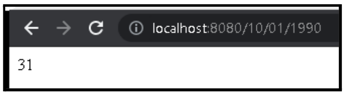

# Exercício 1: Obtendo a idade de uma pessoa
É necessário desenvolver uma API que receba três valores como parâmetro:
* Dia
* Mês
* Ano

Esses valores correspondem à data de nascimento de uma pessoa e devem ser valores
inteiros. Por exemplo, uma entrada válida seria: 01/10/1990.
Para este caso, é necessário que a data de nascimento seja passada através da URL do
navegador. Por exemplo: http://localhost:8080/10/01/1990. Como resultado, a API deve
retornar a idade da pessoa.
No navegador, você deve ver algo semelhante:

Execute as etapas necessárias para implementar um método no controller que mapeie
corretamente o caminho inserido e retorne as informações necessárias.